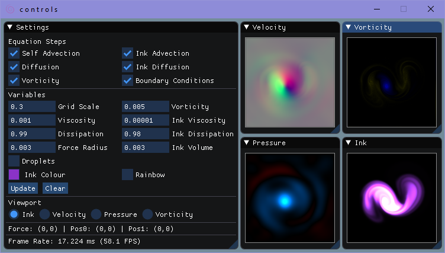

# i n k b o x

This is an implementation of the fluid simulation system described in "Fast Fluid Dynamics Simulation on the GPU" by Mark J. Harris (a chapter in the book "GPU Gems"). I followed along with the chapter and implemented mostly the same system except using modern OpenGL and GLSL rather than the now-deprecated Cg framework. I've also written a 3D version of the system as well as a WebGL version of the 2D simulation. All three simulations have a UI that lets the user change the parameters of the system.

## 2D C++ Simulation
- A visual representation the velocity, pressure and vorticity fields is shown in the controls window
- Each step of the solution to the equation can be toggled to see its effect on the fields
- The constants that are used in the equation can all be modulated
- Rainbow mode
- "Droplets" mode

### Usage
- Click and drag to add ink and force
- Use right-click and drag to only add force
- Press 'p' key to toggle pause

---

## 3D C++ Simulation
- Mostly functional but there's still a few kinks to work out
- The constants that are used in the equation can all be modulated
- Rainbow mode

### Usage
- Click and drag to add ink and force
- Right-click and drag to rotate cube
- Use WASD keys to rotate the cube
- Press 'i' key to add ink at a random location
- Press 'p' key to toggle pause

---

## 2D WebGL Simulation
- Mostly a straightforward port of the C++ version
- Hosted on github.io [here](https://bassicali.github.io/inkbox/)

### Usage
- Click and drag to add ink and force

## Source Material
- [Fast Fluid Dynamics Simulation on the GPU - Mark J. Harris](https://developer.download.nvidia.com/books/HTML/gpugems/gpugems_ch38.html)
- Stam, J. 1999. "Stable Fluids."

## Projects
- [OpenGL](https://www.opengl.org/)
- [GLFW](https://www.glfw.org/)
- [Dear ImGui](https://github.com/ocornut/imgui)
