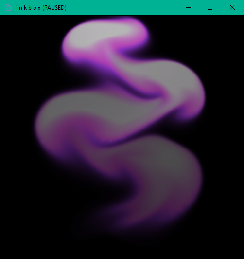

# i n k b o x

This is an implementation of the fluid simulation system described in "Fast Fluid Dynamics Simulation on the GPU" by Mark J. Harris (a chapter in the book "GPU Gems"). I followed along with the chapter and implemented mostly the same system except using OpenGL 4.5 and GLSL rather than the now-deprecated Cg framework. I've also added a UI that lets the user change the parameters of the solution to the divergence-free navier-stokes equations. 

## Features
- A visual representation the velocity, pressure and vorticity fields is shown in the controls winow
- Each step of the solution to the equation can be toggled to see its effect on the fields
- The constants that are used in the equation can all be modulated
- "Droplets" mode

## Usage
- Click and drag to add ink and force
- Use right-click and drag to only add force
- Hit 'p' key to toggle pause

## Screens

## Source Material
- [Fast Fluid Dynamics Simulation on the GPU - Mark J. Harris](https://developer.download.nvidia.com/books/HTML/gpugems/gpugems_ch38.html)
- Stam, J. 1999. "Stable Fluids."

## Projects
- [OpenGL](https://www.opengl.org/)
- [GLFW](https://www.glfw.org/)
- [Dear ImGui](https://github.com/ocornut/imgui)
